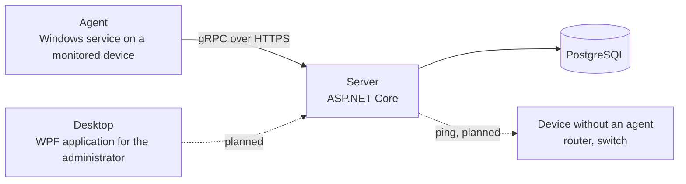

# Network Monitoring & Management System

A client-server application for monitoring network infrastructure and remotely managing the devices connected to it. It is being developed as a bachelor's thesis in C# on .NET 10.

The system is meant to track device availability, network communication, port usage and system resources, keep a record of processes and outages, store history in a database, and allow selected commands to be run on devices remotely, subject to access permissions. The full assignment is in [docs/zadanie.md](docs/zadanie.md) (in Slovak).

## Status

The project is under development. This is what works today and what is still to come.

| Area | State |
|---|---|
| Device registry stored in PostgreSQL | Done |
| Agent registration and periodic heartbeat over gRPC | Done |
| Availability of devices with an agent (online/offline), outages, event log | Done |
| Monitoring of devices without an agent (ping) | Planned |
| CPU, memory, disk and network interface metrics | Planned |
| Open ports, processes and active connections | Planned |
| Network traffic capture | Planned |
| Users, roles and access control | Planned |
| Remote commands with audit | Planned |
| Desktop dashboard | Skeleton only |

## Architecture



- The **agent** runs on each monitored Windows device. It registers with the server once, receives its own key, and then reports at an interval the server dictates.
- The **server** authenticates agents and stores what they report. When an agent stays silent for several intervals, the server marks its device offline, opens an outage and writes an event; the outage is closed when the agent reports again. Devices that cannot run an agent will be checked by the server directly.
- The **desktop application** is the administrator's console.

The planned data model is described in [docs/datovy-model.md](docs/datovy-model.md) (in Slovak).

## Solution layout

| Project | Purpose |
|---|---|
| `src/NetworkMonitoringSystem.Domain` | Domain model and rules, no dependencies |
| `src/NetworkMonitoringSystem.Application` | Use cases and the interfaces they need |
| `src/NetworkMonitoringSystem.Infrastructure` | EF Core, PostgreSQL, migrations |
| `src/NetworkMonitoringSystem.Contracts` | gRPC contracts shared by the server and the agent |
| `src/NetworkMonitoringSystem.Server` | Server host and gRPC endpoints |
| `src/NetworkMonitoringSystem.Agent` | Agent for monitored devices (Windows only) |
| `src/NetworkMonitoringSystem.Desktop` | WPF desktop application (MVVM) |
| `tests/NetworkMonitoringSystem.Tests` | xUnit unit and integration tests |

## Getting started

### Requirements

- Windows 10 or 11
- [.NET 10 SDK](https://dotnet.microsoft.com/download)
- [Docker Desktop](https://www.docker.com/products/docker-desktop/) for the local database and the integration tests

### 1. Configure secrets

No passwords or tokens are stored in the repository. Choose a database password and an agent enrollment token, then set them:

```powershell
Copy-Item .env.example .env
# edit .env and set NMS_DB_PASSWORD

dotnet user-secrets set "Database:Password" "<database password>" --project src/NetworkMonitoringSystem.Server
dotnet user-secrets set "Agents:EnrollmentToken" "<enrollment token>" --project src/NetworkMonitoringSystem.Server
dotnet user-secrets set "Agent:EnrollmentToken" "<enrollment token>" --project src/NetworkMonitoringSystem.Agent
```

The database password must be the same in `.env` and in the server's secrets, and the enrollment token must be the same for the server and the agent.

### 2. Trust the development certificate

The agent only talks to the server over HTTPS, so the local development certificate has to be trusted once:

```powershell
dotnet dev-certs https --trust
```

### 3. Run

```powershell
docker compose up -d
dotnet run --project src/NetworkMonitoringSystem.Server --launch-profile https
```

In a second terminal:

```powershell
dotnet run --project src/NetworkMonitoringSystem.Agent
```

The server applies database migrations on startup in the development environment. The agent should log that it registered with the server; the device then appears in the `Devices` table:

```powershell
docker exec nms-database psql -U nms -d network_monitoring -c 'SELECT \"Name\", \"Status\", \"LastSeenAt\" FROM \"Devices\";'
```

The desktop application starts with `dotnet run --project src/NetworkMonitoringSystem.Desktop`; it does not connect to the server yet.

## Tests

```powershell
dotnet test NetworkMonitoringSystem.slnx
```

Integration tests start a temporary PostgreSQL container, so Docker has to be running. To run only the tests that do not need it:

```powershell
dotnet test NetworkMonitoringSystem.slnx --filter "Category!=Integration"
```

## Database migrations

```powershell
dotnet tool restore
dotnet ef migrations add <Name> --project src/NetworkMonitoringSystem.Infrastructure --startup-project src/NetworkMonitoringSystem.Server --output-dir Persistence/Migrations
```

## Security notes

- An agent registers with a shared enrollment token and is then issued its own random key; the server stores only a SHA-256 hash of that key.
- A device whose agent is reporting cannot be registered again, so the enrollment token alone is not enough to take over a working device.
- The agent keeps its identity in a file encrypted with Windows DPAPI for the account it runs under.
- The agent refuses to connect to a server address that is not HTTPS.
- The local database is published only on `127.0.0.1`.
