# Návrh dátového modelu

Stav: **schválený 2026-10-09**. Databáza: PostgreSQL cez EF Core.

Model pokrýva bod 2 zadania (`docs/zadanie.md`): evidenciu zariadení, ich stavov, systémových prostriedkov a histórie udalostí, a pripravuje tabuľky pre body 3 až 5.

## Diagram

```mermaid
erDiagram
    Device ||--o{ DeviceSnapshot : "má stavy"
    Device ||--o{ Outage : "má výpadky"
    Device ||--o{ TrafficRecord : "má komunikáciu"
    Device ||--o{ RemoteCommand : "prijíma príkazy"
    Device o|--o{ Event : "týka sa"
    Device o|--o{ AccessRule : "obmedzuje na"

    DeviceSnapshot ||--o{ DiskSnapshot : obsahuje
    DeviceSnapshot ||--o{ NetworkInterfaceSnapshot : obsahuje
    DeviceSnapshot ||--o{ ProcessUsage : obsahuje
    Device ||--o{ ProcessRun : "má procesy"
    Device ||--o{ ListeningPort : "má porty"
    Device ||--o{ ActiveConnection : "má spojenia"
    ProcessRun ||--o{ ProcessUsage : "má vyťaženie"
    ProcessRun o|--o{ ListeningPort : "počúva na"
    ProcessRun o|--o{ ActiveConnection : "vlastní"

    User }o--o{ Role : "má (UserRole)"
    Role ||--o{ AccessRule : "má pravidlá"
    User ||--o{ RemoteCommand : "zadáva"
    User o|--o{ Event : "spôsobil"

    Device {
        uuid Id PK
        string Name
        string HostName
        string IpAddress
        enum MonitoringMode "Agent | Agentless"
        enum Status "Unknown | Online | Offline"
        datetime LastSeenAt
        string AgentKeyHash "len pre Agent"
        string OperatingSystem
        bool IsEnabled
        datetime CreatedAt
    }
    DeviceSnapshot {
        bigint Id PK
        uuid DeviceId FK
        datetime RecordedAt
        enum Status
        int ResponseTimeMs "ping, pre Agentless"
        float CpuUsagePercent
        bigint MemoryTotalBytes
        bigint MemoryUsedBytes
    }
    DiskSnapshot {
        bigint Id PK
        bigint SnapshotId FK
        string Name
        bigint TotalBytes
        bigint FreeBytes
    }
    NetworkInterfaceSnapshot {
        bigint Id PK
        bigint SnapshotId FK
        string Name
        string MacAddress
        string IpAddress
        bool IsUp
        bigint BytesSent
        bigint BytesReceived
    }
    ProcessRun {
        bigint Id PK
        uuid DeviceId FK
        int Pid
        string Name
        datetime StartedAt
        datetime EndedAt "null = beží"
    }
    ProcessUsage {
        bigint Id PK
        bigint SnapshotId FK
        bigint ProcessRunId FK
        float CpuUsagePercent
        bigint MemoryBytes
    }
    ListeningPort {
        bigint Id PK
        uuid DeviceId FK
        bigint ProcessRunId FK
        enum Protocol "Tcp | Udp"
        string LocalAddress
        int Port
        datetime OpenedAt
        datetime ClosedAt "null = otvorený"
    }
    ActiveConnection {
        bigint Id PK
        uuid DeviceId FK
        bigint ProcessRunId FK
        enum Protocol
        string LocalAddress
        int LocalPort
        string RemoteAddress
        int RemotePort
        string State
    }
    TrafficRecord {
        bigint Id PK
        uuid DeviceId FK
        datetime PeriodStart
        datetime PeriodEnd
        string Protocol
        string SourceAddress
        int SourcePort
        string DestinationAddress
        int DestinationPort
        bigint PacketCount
        bigint ByteCount
    }
    Outage {
        bigint Id PK
        uuid DeviceId FK
        datetime StartedAt
        datetime EndedAt "null = trvá"
    }
    Event {
        bigint Id PK
        uuid DeviceId FK "nepovinné"
        uuid UserId FK "nepovinné"
        datetime OccurredAt
        enum Type
        enum Severity "Info | Warning | Error"
        string Message
    }
    MonitoringSettings {
        int Id PK "vždy 1 riadok"
        int SyncIntervalSeconds
        int OfflineAfterMissedSyncs
        int RetentionDays
        int TopProcessCount
    }
    User {
        uuid Id PK
        string UserName
        string PasswordHash
        bool IsActive
        datetime CreatedAt
    }
    Role {
        uuid Id PK
        string Name
    }
    AccessRule {
        bigint Id PK
        uuid RoleId FK
        enum Permission
        uuid DeviceId FK "null = všetky zariadenia"
    }
    RemoteCommand {
        uuid Id PK
        uuid DeviceId FK
        uuid RequestedByUserId FK
        enum CommandType
        json Parameters
        enum Status "Pending | Sent | Succeeded | Failed | Rejected"
        datetime RequestedAt
        datetime CompletedAt
        string ResultMessage
    }
```

## Skupiny tabuliek

### Zariadenia

`Device` je jediná evidencia zariadení. `MonitoringMode` rozlišuje zariadenie s agentom (posiela údaje samo) od zariadenia bez agenta (server ho kontroluje pingom). `Status` a `LastSeenAt` sú aktuálny stav, aby ho dashboard nemusel počítať z histórie. `AgentKeyHash` slúži na overenie identity agenta; ukladá sa len odtlačok kľúča, nie kľúč.

### Stavy a systémové prostriedky

`DeviceSnapshot` je jeden zápis stavu zariadenia v jednom okamihu; vzniká raz za globálny interval. Pri zariadení bez agenta obsahuje len `Status` a `ResponseTimeMs`, pri zariadení s agentom aj CPU a pamäť a naň naviazané riadky `DiskSnapshot` a `NetworkInterfaceSnapshot` (disky a sieťové rozhrania).

### Procesy, porty a spojenia

Tieto údaje sa neukladajú pri každom zápise celé. Agent posiela úplný aktuálny zoznam, server ho porovná s predošlým stavom a uloží len zmeny:

- `ProcessRun` je obdobie behu jedného procesu: začiatok a koniec. Windows čísla PID recykluje, preto proces jednoznačne určuje až dvojica PID a čas spustenia.
- `ProcessUsage` je vyťaženie procesu v danom zápise stavu. Ukladá sa len pre `TopProcessCount` procesov najnáročnejších na CPU a pamäť (predvolene 10).
- `ListeningPort` je obdobie, počas ktorého bol port otvorený, s odkazom na proces, ktorý na ňom počúva.
- `ActiveConnection` je len aktuálny zoznam spojení; pri každej synchronizácii sa nahradí. Históriu komunikácie pokrýva `TrafficRecord`.

Odkaz na `ProcessRun` rieši požiadavku zadania na „súvisiace procesy" – ku každému portu a spojeniu je známy proces, ktorý ho používa. Otvorenie nového portu server zároveň zapíše do `Event`; spustenie procesu nie, lebo procesy vznikajú neustále a udalosti by zahltili záznam.

Dve spresnenia, ktoré vyplynuli z implementácie:

- UDP porty v dynamickom rozsahu (od 49152) sa neukladajú. Programy ich otvárajú a zatvárajú neustále pre vlastnú odchádzajúcu komunikáciu, takže nejde o služby zariadenia.
- Prvé hlásenie zariadenia sa berie ako východiskový stav a nevytvára žiadne udalosti.

### Sieťová komunikácia

`TrafficRecord` neukladá jednotlivé pakety, ale súhrn za časové okno: kto s kým, akým protokolom, koľko paketov a bajtov. Surové pakety by databázu rýchlo zaplnili a obsahovali by citlivý obsah komunikácie.

### Výpadky a udalosti

`Outage` má začiatok a koniec výpadku; z neho sa počíta dostupnosť. `Event` je všeobecný záznam udalostí: zmena stavu zariadenia, registrácia agenta, zmena intervalu, prihlásenie, zamietnutý prístup a podobne.

### Nastavenia

`MonitoringSettings` má vždy jeden riadok. Obsahuje globálny interval synchronizácie, počet vynechaných synchronizácií, po ktorých sa zariadenie považuje za nedostupné, dobu uchovávania histórie a počet procesov, ktorých vyťaženie sa ukladá.

### Používatelia a ACL

Implementované tabuľky: `Users`, `Roles`, `UserRoles`, `AccessRules` a navyše `UserSessions` (prihlásené relácie; ukladá sa len odtlačok tokenu a čas vypršania). Používateľ má pri sebe aj počet chybných prihlásení a čas, dokedy je účet zamknutý.

Používateľ má roly, rola má pravidlá. `AccessRule` hovorí: rola smie vykonať `Permission` na zariadení `DeviceId`, alebo na všetkých, ak je `DeviceId` prázdne. Zoznam oprávnení je pevný a definovaný v kóde (napríklad zobrazenie zariadení, správa používateľov a jedno oprávnenie pre každý príkaz vzdialenej správy).

### Vzdialená správa

`RemoteCommand` je zároveň front príkazov aj auditný záznam: kto, kedy, čo, na ktorom zariadení a s akým výsledkom. `CommandType` je pevný zoznam schválených príkazov; `Parameters` nesie ich overené parametre (napríklad PID alebo názov služby). Zamietnuté pokusy bez oprávnenia sa zapisujú do `Event`.

## Návrhové rozhodnutia

1. **Procesy a porty sa ukladajú ako obdobia, nie pri každom zápise stavu.** Ukladanie všetkých procesov každý interval by pri 150 procesoch a intervale 60 sekúnd znamenalo približne 216 000 riadkov na zariadenie denne. Ukladanie zmien a vyťaženia len najnáročnejších procesov to znižuje asi na 15 000 až 20 000 a porovnávanie stavov zároveň dáva udalosti o nových portoch a procesoch. Cena je logika porovnávania na serveri a strata presného vyťaženia procesov mimo najnáročnejších. Staré údaje sa navyše mažú podľa `RetentionDays`.
2. **Jedna tabuľka `DeviceSnapshot` pre stav aj prostriedky**, nie dve oddelené. Menej spojení pri čítaní; cena sú prázdne stĺpce pri zariadeniach bez agenta.
3. **Aktuálny stav je uložený priamo v `Device`**, hoci sa dá odvodiť z histórie. Zrýchľuje to dashboard; server ho musí udržiavať v súlade s históriou.
4. **Oprávnenia sú pevný zoznam v kóde, nie tabuľka.** Nové oprávnenie aj tak vyžaduje zmenu kódu, ktorý ho kontroluje.

## Poradie implementácie

Model sa nebude zavádzať naraz. Každá skupina tabuliek pribudne vlastnou migráciou spolu s funkciou, ktorá ju používa:

1. `Device` (rozšírený o IP adresu, režim sledovania a stav) a `MonitoringSettings`. Stĺpce `AgentKeyHash` a `OperatingSystem` pribudnú až s komunikáciou agenta.
2. `DeviceSnapshot`, `Outage`, `Event` s dostupnosťou zariadení.
3. Disky, rozhrania, procesy, porty a spojenia s monitoringom prostriedkov.
4. `TrafficRecord` so sledovaním komunikácie.
5. `User`, `Role`, `AccessRule` s autentifikáciou.
6. `RemoteCommand` so vzdialenou správou.
